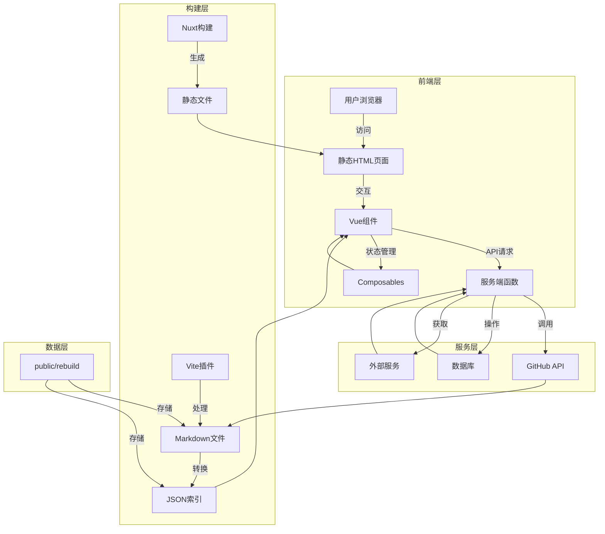

# Nuxt3-Blog 项目详细文档

## 1. 项目概览

Nuxt3-Blog 是一个基于 Nuxt 3 构建的现代化、高性能的个人博客系统，旨在提供简单易用但功能强大的博客解决方案。

- **快速搭建**：5分钟完成搭建，无需编写代码
- **全功能后台**：通过网页端管理界面，实现内容的实时更新
- **纯静态生成**：打包为纯静态网站，无需后端服务
- **SEO 友好**：预渲染 HTML 页面，利于搜索引擎收录
- **高度可扩展**：提供多种可选扩展功能，如图片床集成、浏览量统计等
- **多平台部署**：支持 Vercel、Cloudflare Pages、Netlify 等多种部署方式

**典型应用场景**：
- 个人技术博客
- 知识分享平台
- 个人作品集展示
- 企业内部知识库

## 2. 目录结构

Nuxt3-Blog 采用清晰的目录结构，遵循 Nuxt 3 的最佳实践，同时针对博客系统的特性进行了优化。核心代码与配置分离，数据与逻辑分离，使得项目结构清晰易懂，易于维护和扩展。

```text
├── app/                  # Nuxt 3 应用主目录
│   ├── assets/           # 静态资源文件
│   │   ├── image/        # 图片资源
│   │   └── style/        # 样式文件
│   ├── components/       # Vue 组件
│   ├── composables/      # 可复用的组合式函数
│   ├── layouts/          # 页面布局
│   ├── middleware/       # 路由中间件
│   ├── pages/            # 页面组件
│   ├── plugins/          # Nuxt 插件
│   └── utils/            # 工具函数
├── docs/                 # 项目文档
├── e2e/                  # 端到端测试
├── i18n/                 # 国际化文件
├── public/               # 公共静态文件
│   ├── rebuild/          # 博客数据
│   ├── sticker/          # 表情图片
│   └── favicon.png       # 网站图标
├── scripts/              # 构建脚本
├── server/               # 服务端 API
├── types/                # TypeScript 类型定义
├── vite-plugins/         # Vite 插件
├── config.ts             # 博客配置
├── nuxt.config.ts        # Nuxt 配置
└── package.json          # 项目依赖
```

**核心目录说明**：

| 目录/文件            | 职责说明                                                           |
|-------------------|----------------------------------------------------------------|
| app/assets/style/ | 包含全局样式、代码高亮样式等，支持自定义主题                         |
| app/components/   | 包含所有 Vue 组件，如卡片配置、日历、引用等功能组件                 |
| app/composables/  | 包含可复用的组合式函数，如加密工具、国际化、主题切换等               |
| app/pages/        | 包含所有页面组件，按路由结构组织，如文章、记录、知识库等             |
| app/utils/        | 包含各类工具函数，如 API 调用、Markdown 处理、通用工具等           |
| public/rebuild/   | 存储博客数据，包括文章、记录、知识库等内容的 Markdown 文件和 JSON 索引 |
| server/api/       | 包含服务端 API 路由，如数据库操作、新闻数据获取、图片上传等         |
| scripts/          | 包含构建脚本，如图片处理、RSS 生成、Algolia 数据导出等             |
| config.ts         | 博客核心配置文件，包含站点信息、分析工具、搜索服务等配置             |

## 3. 系统架构与主流程

Nuxt3-Blog 采用现代化的前端架构，基于 Nuxt 3 和 Vue 3 构建，结合了静态站点生成 (SSG) 和服务端渲染 (SSR) 的优势，同时提供了完整的内容管理系统。

### 系统架构



### 主要流程

1. **内容管理流程**：
   - 用户通过后台管理界面编辑内容
   - 内容通过 GitHub API 存储到仓库
   - Vite 插件在构建时处理 Markdown 文件
   - 生成 JSON 索引文件供前端查询

2. **页面渲染流程**：
   - 构建时预渲染所有页面为静态 HTML
   - 用户访问时直接加载静态 HTML
   - 激活 Vue 组件实现交互功能
   - 必要时通过服务端 API 获取动态数据

3. **部署流程**：
   - 代码推送触发 CI/CD 流程
   - 构建生成静态文件
   - 部署到静态托管服务
   - 可选：配置自定义域名和 CDN

### 核心技术栈

| 类别     | 技术/库                    | 用途                                  |
|--------|-------------------------|-------------------------------------|
| 框架     | Nuxt 3                  | 基于 Vue 3 的全栈框架，提供 SSG/SSR 能力      |
| 前端     | Vue 3, TypeScript       | 构建响应式用户界面                         |
| 样式     | Tailwind CSS            | 实用优先的 CSS 框架，提供响应式设计             |
| 构建工具   | Vite                    | 现代化前端构建工具，提供快速的开发体验             |
| 测试     | Vitest, Playwright      | 单元测试和端到端测试                        |
| 内容处理   | Marked, Highlight.js    | Markdown 解析和代码高亮                    |
| 国际化    | Vue I18n                | 多语言支持                              |
| 搜索     | Algolia                 | 全站搜索功能                              |
| 部署     | Vercel, Cloudflare Pages | 静态网站托管服务                           |

## 4. 核心功能模块

### 4.1 内容管理系统

**功能说明**：提供完整的后台管理界面，支持文章、记录、知识库的创建、编辑和删除。

**核心特性**：
- 基于 Monaco Editor 的富文本编辑器，支持 Markdown 语法
- 实时预览功能，所见即所得
- 内容版本管理，支持查看历史版本和回滚
- 标签管理，方便内容分类
- 自定义 slug，支持 SEO 友好的 URL

**实现原理**：
- 使用 GitHub API 作为存储后端
- 通过 Vite 插件在构建时处理 Markdown 文件
- 生成静态 HTML 页面和 JSON 索引文件

**关键文件**：
- `app/pages/manage/` - 管理界面页面组件
- `app/utils/nuxt/manage/` - 管理相关工具函数
- `vite-plugins/rebuild.ts` - 构建时处理 Markdown 文件

### 4.2 主题与样式系统

**功能说明**：提供灵活的主题和样式系统，支持明暗模式切换和自定义主题色。

**核心特性**：
- 自动切换明暗模式，跟随系统设置
- 支持多种预设主题色，可随机或固定使用
- 响应式设计，适配不同屏幕尺寸
- 移动端友好的导航模式

**实现原理**：
- 使用 CSS 变量和 Tailwind CSS 实现主题切换
- 通过 LocalStorage 持久化主题设置
- 构建时生成主题颜色 CSS 文件

**关键文件**：
- `app/composables/themeMode.ts` - 主题模式管理
- `app/utils/common/constants.ts` - 主题相关常量
- `scripts/utils/html.ts` - 生成主题颜色 CSS

### 4.3 搜索与 SEO

**功能说明**：提供全站搜索功能和 SEO 优化，提升网站可发现性。

**核心特性**：
- 基于 Algolia 的全文搜索，支持实时结果
- 自动生成站点地图 (sitemap.xml)
- 优化的元标签和结构化数据
- 自定义页面标题和描述

**实现原理**：
- 构建时导出数据到 Algolia
- 使用 Nuxt 的头部配置实现 SEO 优化
- 静态生成确保搜索引擎可收录

**关键文件**：
- `scripts/nuxt-hooks.ts` - 生成站点地图和上传 Algolia 数据
- `app/plugins/seo.ts` - SEO 相关插件
- `nuxt.config.ts` - 头部配置和路由生成

### 4.4 评论系统

**功能说明**：集成 GitHub Discussions 作为评论系统，无需额外后端。

**核心特性**：
- 基于 GitHub Discussions，无需注册
- 支持回复、点赞等互动功能
- 自动关联文章和评论线程

**实现原理**：
- 使用 GitHub API 获取和创建评论
- 通过配置文件关联 GitHub 仓库和分类

**关键文件**：
- `config.ts` - 评论系统配置
- `app/utils/nuxt/viewer.ts` - 评论系统集成

### 4.5 图片管理

**功能说明**：提供图片上传、管理和优化功能，支持集成第三方图床。

**核心特性**：
- 支持上传图片到 SMMS 图床
- 图片批量下载和备份
- 图片链接替换和优化

**实现原理**：
- 通过服务端 API 处理图片上传
- 使用 Gulp 脚本处理图片批量操作
- 构建时优化图片引用

**关键文件**：
- `server/api/smms/` - 图片上传 API
- `scripts/download-img.ts` - 图片下载脚本
- `scripts/substitute-img.ts` - 图片链接替换脚本

### 4.6 数据统计与分析

**功能说明**：提供网站访问统计和分析功能，帮助了解用户行为。

**核心特性**：
- 集成 Microsoft Clarity 和 Cloudflare Analytics
- 支持文章浏览量统计
- 可配置的访问量初始值和过滤规则

**实现原理**：
- 使用服务端 API 处理访问量统计
- 集成第三方分析工具的 SDK
- 通过配置文件控制统计行为

**关键文件**：
- `server/api/db/` - 数据库操作 API
- `config.ts` - 统计工具配置
- `app/utils/nuxt/fetch.ts` - 数据获取工具

## 5. 核心 API/类/函数

### 5.1 内容管理 API

#### `useBlogItem`
**功能**：处理单个博客项目的 CRUD 操作
**参数**：
- `type`: 内容类型 ('articles' | 'records' | 'knowledges')
- `id`: 内容 ID

**返回值**：包含内容详情、更新函数、删除函数等的对象
**使用场景**：编辑和查看单个博客内容
**文件位置**：`app/utils/hooks/useBlogItem.ts`

#### `useBlogList`
**功能**：获取和管理博客内容列表
**参数**：
- `type`: 内容类型
- `page`: 页码
- `pageSize`: 每页数量
- `tag`: 标签过滤

**返回值**：包含内容列表、分页信息、加载状态等的对象
**使用场景**：展示博客内容列表，支持分页和标签过滤
**文件位置**：`app/utils/hooks/useBlogList.ts`

### 5.2 工具函数

#### `processEncryptDecrypt`
**功能**：处理内容加密和解密
**参数**：
- `content`: 要加密/解密的内容
- `password`: 密码
- `action`: 操作类型 ('encrypt' | 'decrypt')

**返回值**：处理后的内容
**使用场景**：加密敏感内容，保护隐私
**文件位置**：`app/utils/common/process-encrypt-decrypt.ts`

#### `markdownToHtml`
**功能**：将 Markdown 转换为 HTML
**参数**：
- `markdown`: Markdown 内容
- `options`: 转换选项

**返回值**：转换后的 HTML 内容
**使用场景**：渲染博客内容，支持代码高亮、数学公式等
**文件位置**：`app/utils/common/markdown.ts`

### 5.3 服务端 API

#### `uploadImage`
**功能**：上传图片到 SMMS 图床
**参数**：
- `file`: 图片文件

**返回值**：包含图片 URL 的对象
**使用场景**：在编辑器中上传图片
**文件位置**：`server/api/smms/upload.ts`

#### `incrementVisitors`
**功能**：增加文章浏览量
**参数**：
- `id`: 文章 ID
- `type`: 内容类型

**返回值**：更新后的浏览量
**使用场景**：统计文章访问量
**文件位置**：`server/api/db/inc-visitors.ts`

### 5.4 构建工具

#### `rebuildPlugin`
**功能**：构建时处理 Markdown 文件和生成 JSON 索引
**参数**：
- `options`: 插件选项

**返回值**：Vite 插件对象
**使用场景**：构建过程中处理博客内容
**文件位置**：`vite-plugins/rebuild.ts`

#### `generateSiteMap`
**功能**：生成站点地图
**参数**：
- `outputDir`: 输出目录

**返回值**：无
**使用场景**：构建时生成 SEO 友好的站点地图
**文件位置**：`scripts/nuxt-hooks.ts`

## 6. 技术栈与依赖

Nuxt3-Blog 采用现代化的前端技术栈，结合了多个优秀的库和工具，构建了一个功能完整、性能优异的博客系统。

| 类别     | 技术/库                | 版本           | 用途                                  | 来源                                      |
|--------|---------------------|--------------|-------------------------------------|-----------------------------------------|
| 核心框架   | Nuxt                | ^4.0.2       | 基于 Vue 的全栈框架，提供 SSG/SSR 能力     | package.json:70                         |
| 前端框架   | Vue                 | ^3.4.0       | 响应式前端框架                           | 内置依赖                                    |
| 样式框架   | Tailwind CSS        | ^3.4.0       | 实用优先的 CSS 框架，支持响应式设计           | package.json:44                         |
| 路由     | Vue Router          | ^4.5.1       | 客户端路由管理                           | package.json:38                         |
| 构建工具   | Vite                | ^6.0.0       | 现代化前端构建工具                         | 内置依赖                                    |
| 类型系统   | TypeScript          | ^5.8.3       | 静态类型检查                             | package.json:81                         |
| 编辑器    | Monaco Editor       | ^0.52.2      | 代码编辑器，用于后台管理                     | package.json:35                         |
| Markdown | Marked              | ^16.1.1      | Markdown 解析器                         | package.json:33                         |
| 代码高亮   | Highlight.js        | ^11.11.1     | 代码语法高亮                             | package.json:29                         |
| 数学公式   | KaTeX               | ^0.16.22     | 数学公式渲染                             | package.json:31                         |
| 图表     | Mermaid             | ^11.9.0      | 图表和流程图渲染                           | package.json:34                         |
| 日期处理   | Day.js              | ^1.11.13     | 轻量级日期处理库                          | package.json:28                         |
| HTTP 客户端 | Axios               | ^1.11.0      | HTTP 请求客户端                          | package.json:25                         |
| 加密     | CryptoJS            | ^4.2.0       | 客户端加密工具                            | package.json:27                         |
| 搜索     | Algolia Search      | ^5.35.0      | 全文搜索服务                             | package.json:55                         |
| 测试     | Vitest              | ^3.2.4       | 单元测试框架                             | package.json:84                         |
| 测试     | Playwright          | ^1.54.1      | 端到端测试框架                            | package.json:45                         |
| 脚本工具   | Gulp                | ^5.0.1       | 自动化构建工具                            | package.json:63                         |
| 工具库    | Lodash              | ^4.17.21     | 实用工具函数库                            | package.json:68                         |
| 图标     | Lucide Vue Next     | ^0.477.0     | 现代图标库                               | package.json:69                         |

## 7. 关键模块与典型用例

### 7.1 内容管理模块

**功能说明**：内容管理模块是博客系统的核心，允许用户在网页端创建、编辑和删除博客内容，无需直接操作文件系统或 Git 仓库。

**配置与依赖**：
- 配置文件：`config.ts` 中的 `githubName` 和 `githubRepo`
- 依赖：GitHub API 访问权限（需要设置个人访问令牌）

**使用流程**：
1. 访问 `/manage` 页面，输入 GitHub 个人访问令牌
2. 选择内容类型（文章、记录、知识库）
3. 点击 "新建" 创建内容，或选择现有内容进行编辑
4. 使用 Monaco Editor 编辑 Markdown 内容
5. 点击 "保存" 提交更改，系统会自动更新到 GitHub 仓库
6. 构建系统会自动处理新内容，生成静态页面

**示例代码**：
```typescript
// 保存博客内容
const saveBlogItem = async (type: string, id: string, content: string) => {
  // 调用 GitHub API 保存内容
  const response = await $fetch(`/api/github/save`, {
    method: 'POST',
    body: { type, id, content }
  });
  
  return response;
};
```

### 7.2 图片管理模块

**功能说明**：图片管理模块允许用户上传、管理和优化博客中的图片，支持集成第三方图床服务。

**配置与依赖**：
- 配置文件：无需特殊配置，默认使用 SMMS 图床
- 依赖：SMMS API 访问权限（需要 API 密钥）

**使用流程**：
1. 在编辑器中点击图片上传按钮
2. 选择本地图片文件
3. 系统会自动上传图片到图床，并返回图片链接
4. 图片链接会自动插入到 Markdown 内容中
5. 可以使用 `local:download-img` 脚本批量下载图片进行备份
6. 可以使用 `local:substitute-img` 脚本批量替换图片链接

**示例代码**：
```typescript
// 上传图片到 SMMS
const uploadImage = async (file: File) => {
  const formData = new FormData();
  formData.append('smfile', file);
  
  const response = await $fetch(`/api/smms/upload`, {
    method: 'POST',
    body: formData
  });
  
  return response.data.url;
};
```

### 7.3 搜索模块

**功能说明**：搜索模块提供全站内容搜索功能，基于 Algolia 搜索引擎，支持实时结果和高亮显示。

**配置与依赖**：
- 配置文件：`config.ts` 中的 `algoliaSearch` 配置
- 依赖：Algolia 账户和索引

**使用流程**：
1. 在 `config.ts` 中配置 Algolia 应用 ID、搜索密钥和索引名称
2. 运行 `local:upload-algolia` 脚本上传初始数据
3. 构建时系统会自动更新 Algolia 索引
4. 在网站搜索框中输入关键词，即可看到实时搜索结果

**示例代码**：
```typescript
// 搜索内容
const searchContent = async (query: string) => {
  if (!query) return [];
  
  const response = await $fetch(`/api/algolia/search`, {
    method: 'POST',
    body: { query }
  });
  
  return response.hits;
};
```

### 7.4 主题配置模块

**功能说明**：主题配置模块允许用户自定义网站主题，包括明暗模式切换和主题颜色选择。

**配置与依赖**：
- 配置文件：`config.ts` 中的 `themeColor` 和 `themeColorDark` 配置
- 依赖：无需额外依赖

**使用流程**：
1. 在 `config.ts` 中配置默认主题颜色
2. 网站会自动生成主题颜色 CSS
3. 用户可以通过界面切换明暗模式
4. 主题设置会保存在 LocalStorage 中，下次访问时保持一致

**示例代码**：
```typescript
// 切换主题模式
const toggleThemeMode = () => {
  const newMode = currentMode.value === 'light' ? 'dark' : 'light';
  currentMode.value = newMode;
  document.documentElement.classList.remove(currentMode.value);
  document.documentElement.classList.add(newMode);
  localStorage.setItem(ThemeModeKey, newMode);
};
```

## 8. 配置、部署与开发

### 8.1 本地开发

**环境要求**：
- Node.js 20.x
- pnpm 9.x

**开发流程**：
1. 克隆仓库：`git clone https://github.com/win2happy/nuxt3-blog.git`
2. 安装依赖：`pnpm install`
3. 修改配置：编辑 `config.ts` 文件，设置 GitHub 用户名等基本信息
4. 启动开发服务器：`pnpm dev`
5. 访问 `http://localhost:3000` 查看网站
6. 访问 `http://localhost:3000/manage` 进入管理界面

**开发命令**：
- `pnpm dev`：启动开发服务器
- `pnpm build`：构建生产版本
- `pnpm test:unit`：运行单元测试
- `pnpm test:e2e`：运行端到端测试
- `pnpm eslint`：运行 ESLint 检查

### 8.2 部署选项

Nuxt3-Blog 支持多种部署方式，适应不同的需求和场景：

#### 8.2.1 静态托管服务

**Vercel 部署**：
1. 登录 Vercel 账户
2. 导入 GitHub 仓库
3. 配置构建命令：`pnpm build`
4. 配置输出目录：`.output/public`
5. 点击 "Deploy" 开始部署
6. 部署完成后配置自定义域名（可选）

**Cloudflare Pages 部署**：
1. 登录 Cloudflare 账户
2. 进入 Pages 控制台
3. 连接 GitHub 仓库
4. 配置构建命令：`pnpm build`
5. 配置输出目录：`.output/public`
6. 点击 "Save and Deploy" 开始部署
7. 部署完成后配置自定义域名（可选）

**Netlify 部署**：
1. 登录 Netlify 账户
2. 导入 GitHub 仓库
3. 配置构建命令：`pnpm build`
4. 配置发布目录：`.output/public`
5. 点击 "Deploy site" 开始部署
6. 部署完成后配置自定义域名（可选）

#### 8.2.2 自托管部署

**Docker 部署**：
1. 构建 Docker 镜像：`docker build -t nuxt3-blog .`
2. 运行容器：`docker run -p 3000:3000 nuxt3-blog`
3. 访问 `http://localhost:3000` 查看网站

**Node.js 部署**：
1. 构建项目：`pnpm build`
2. 启动服务：`node .output/server/index.mjs`
3. 访问 `http://localhost:3000` 查看网站

### 8.3 配置说明

`config.ts` 是博客的核心配置文件，包含了站点信息、分析工具、搜索服务等配置：

| 配置项                    | 说明                                     | 默认值                           |
|------------------------|----------------------------------------|-------------------------------|
| githubName             | GitHub 用户名，必须修改                        | "win2happy"                   |
| githubApiUrl           | 自定义 GitHub API 域名                      | "https://api.github.com"      |
| title                  | 网站标题                                   | "Imuer视界"                      |
| nickName               | 昵称                                     | "IM"                          |
| domain                 | RSS 域名                                 | "https://imuer.pnt.pp.ua"     |
| SEO_title              | 搜索引擎显示的标题                             | " - IM blog"                  |
| SEO_keywords           | keywords meta header                    | "IM,imuer's blog,Imuer视界"    |
| MSClarityId            | Microsoft Clarity 统计 ID                | "uqyzrv8y66"                  |
| CloudflareAnalyze      | Cloudflare Analytics ID                 | "1c42957b8103aa01e99ea05293952604" |
| CommentRepoId          | 评论系统 GitHub 仓库 ID                     | "R_kgDOQuotxw"                |
| CommentDiscussionCategoryId | 评论系统 GitHub 分类 ID                  | "DIC_kwDOQuotx84C0Oko"        |
| database               | 数据库配置                                   | 包含 initialVisitors 和 visitFromOwner |
| algoliaSearch          | Algolia 搜索配置                            | 包含 appId、searchKey 和 indexName |
| themeColor             | 主题色列表                                  | ["cyan", "sky", "teal", ...]  |
| themeColorDark         | 夜间模式主题色                                | "neutral"                     |
| defaultLang            | 默认语言                                   | "zh"                          |
| mobileNavMode          | 移动端导航栏模式                               | "content-tabs"                |
| about                  | 关于页面内容                                 | 数组形式的文本内容                     |
| readingProgress        | 阅读进度条配置                                | 包含 enabled、color、height 和 position |
| newsCard               | 新闻卡片配置                                 | 包含渐变颜色和文本颜色                  |
| githubRepo             | GitHub 仓库名                              | "nuxt3-blog"                  |

## 9. 监控与维护

### 9.1 日志与监控

Nuxt3-Blog 集成了多种监控工具，帮助了解网站的访问情况和用户行为：

- **Microsoft Clarity**：提供热力图、会话录制等用户行为分析
- **Cloudflare Analytics**：提供流量统计、地区分布等基础分析
- **自定义浏览量统计**：记录每篇文章的访问次数

**监控数据查看**：
- Microsoft Clarity：登录 Clarity 控制台查看详细报告
- Cloudflare Analytics：登录 Cloudflare 控制台查看网站分析
- 文章浏览量：在文章页面底部查看实时浏览量

### 9.2 常见问题与解决方案

| 问题                   | 可能原因                                  | 解决方案                                        |
|----------------------|---------------------------------------|---------------------------------------------|
| 管理界面无法登录             | GitHub 令牌无效或权限不足                      | 生成新的 GitHub 令牌，确保包含 repo 权限             |
| 图片上传失败               | SMMS API 密钥无效或网络问题                   | 检查 SMMS API 密钥，或尝试使用其他网络环境               |
| 搜索功能无响应              | Algolia 配置错误或数据未同步                    | 检查 Algolia 配置，运行 `local:upload-algolia` 脚本 |
| 构建失败                 | 依赖安装不完整或配置错误                        | 重新安装依赖，检查 `config.ts` 配置                 |
| 访问量统计不准确             | 数据库配置错误或缓存问题                        | 检查 `database` 配置，清除浏览器缓存                  |
| 评论系统不显示              | GitHub 仓库配置错误或权限不足                    | 检查 `CommentRepoId` 和 `CommentDiscussionCategoryId` 配置 |
| 主题切换无效               | 浏览器存储问题或 CSS 加载错误                    | 清除浏览器缓存，检查主题相关 CSS 文件                 |
| 部署后内容不更新             | 构建缓存或 CDN 缓存                           | 强制重新构建，清除 CDN 缓存                         |

### 9.3 定期维护任务

为确保博客系统的稳定运行和最佳性能，建议定期执行以下维护任务：

1. **更新依赖**：定期运行 `pnpm update` 更新项目依赖，确保安全性和性能
2. **备份数据**：使用 `local:download-img` 脚本定期备份图片，使用 Git 版本控制备份内容
3. **检查链接**：定期检查博客中的外部链接，确保它们仍然有效
4. **优化图片**：使用图片压缩工具优化博客中的图片，提高加载速度
5. **监控性能**：使用 Lighthouse 等工具定期检查网站性能，进行必要的优化
6. **安全检查**：定期检查依赖的安全性，更新存在漏洞的包

## 10. 总结与亮点回顾

Nuxt3-Blog 是一个功能完整、性能优异的现代化博客系统，它结合了静态站点生成的速度和服务端渲染的灵活性，同时提供了完整的内容管理系统，使得博客的搭建和维护变得简单高效。

### 项目亮点

1. **极简搭建流程**：5分钟完成搭建，无需编写代码，适合各类用户
2. **全功能后台管理**：基于 GitHub API 的内容管理系统，无需额外后端
3. **多平台部署支持**：支持 Vercel、Cloudflare Pages、Netlify 等多种部署方式
4. **高度可定制**：支持自定义主题、颜色、布局等，满足个性化需求
5. **优秀的性能**：静态生成确保快速加载，优化的资源处理减少页面大小
6. **完善的 SEO**：自动生成站点地图，优化的元标签，确保搜索引擎可收录
7. **丰富的功能**：支持评论、搜索、统计、图片管理等多种功能
8. **良好的扩展性**：模块化设计，易于添加新功能和集成外部服务
9. **类型安全**：使用 TypeScript 确保代码质量和可维护性
10. **完整的测试**：包含单元测试和端到端测试，确保系统稳定性

### 技术创新

1. **混合架构**：结合了 SSG 和 SSR 的优势，既保证了加载速度，又提供了动态功能
2. **Vite 插件**：自定义 Vite 插件处理 Markdown 文件，实现内容的自动转换和索引
3. **GitHub 集成**：将 GitHub 作为内容存储后端，无需额外数据库
4. **模块化设计**：使用 Composables 和 Utils 实现功能的模块化，提高代码复用率
5. **响应式主题**：基于 CSS 变量和 Tailwind CSS 实现的动态主题系统

### 应用前景

Nuxt3-Blog 不仅是一个功能完整的博客系统，也是一个学习现代前端技术的优秀案例。它展示了如何使用 Nuxt 3、Vue 3、TypeScript 等技术构建一个生产级别的应用，同时提供了完整的内容管理解决方案。

随着静态站点生成技术的不断发展，Nuxt3-Blog 有望在以下领域得到更广泛的应用：
- 企业文档中心
- 教育资源平台
- 产品知识库
- 个人品牌网站

通过持续的迭代和改进，Nuxt3-Blog 有潜力成为静态博客系统的优秀选择，为用户提供简单、高效、强大的内容管理解决方案。

## 11. 附录

### 11.1 常用脚本命令

| 命令                      | 说明                                      |
|-------------------------|-------------------------------------------|
| `pnpm dev`              | 启动开发服务器                              |
| `pnpm build`            | 构建生产版本                                |
| `pnpm preview`          | 预览生产构建                                |
| `pnpm test:unit`        | 运行单元测试                                |
| `pnpm test:e2e`         | 运行端到端测试                              |
| `pnpm eslint`           | 运行 ESLint 检查                            |
| `pnpm local:change-pwd` | 全局修改密码                                |
| `pnpm local:generate-img-map` | 收集全站图片，输出到 img.json             |
| `pnpm local:download-img` | 读取 img.json，下载所有图片到 imgs/       |
| `pnpm local:substitute-img` | 读取 img.json，替换为新的图片             |
| `pnpm local:upload-algolia` | 上传所有索引到 Algolia                    |

### 11.2 项目版本历史

| 版本 | 发布日期 | 主要特性 |
|-----|---------|---------|
| v1  | 2023-03 | 初始版本，基础博客功能 |
| v2  | 2023-06 | 增加后台管理功能 |
| v3  | 2023-09 | 支持静态站点生成 |
| v4  | 2023-12 | 集成评论系统和搜索功能 |
| v5  | 2024-03 | 支持多平台部署 |
| v6  | 2024-06 | 增加图片管理功能 |
| v7  | 2024-09 | 支持块级加密和自定义主题 |
| v8  | 2024-12 | 优化性能和用户体验 |
| v9  | 2025-03 | 增加数据统计和分析功能 |
| v10 | 2025-06 | 支持 Nuxt 4 和 Vue 3.4 |

### 11.3 相关资源

- **官方文档**：[GitHub Wiki](https://github.com/win2happy/nuxt3-blog/wiki)
- **示例博客**：[Imuer视界](https://imuer.pnt.pp.ua)
- **搭建教程**：[5分钟搭建个人博客](https://imuer.pnt.pp.ua/articles/8346)
- **GitHub 仓库**：[win2happy/nuxt3-blog](https://github.com/win2happy/nuxt3-blog)
- **问题反馈**：[GitHub Issues](https://github.com/win2happy/nuxt3-blog/issues)

### 11.4 贡献指南

Nuxt3-Blog 欢迎社区贡献，无论是功能改进、bug 修复还是文档完善，都可以通过以下方式参与：

1. **提交 Issue**：报告 bug 或提出新功能建议
2. **提交 Pull Request**：直接贡献代码
3. **改进文档**：完善 Wiki 和 README
4. **分享使用经验**：撰写博客或教程分享使用心得

**贡献流程**：
1. Fork 仓库
2. 创建 feature 分支
3. 提交更改
4. 推送到远程分支
5. 提交 Pull Request

**代码规范**：
- 遵循 ESLint 规则
- 使用 TypeScript 类型标注
- 保持代码风格一致
- 编写测试用例（如果适用）

---

**文档更新时间**：2026-01-16
**文档版本**：v1.0.0
**项目版本**：v10.0.0